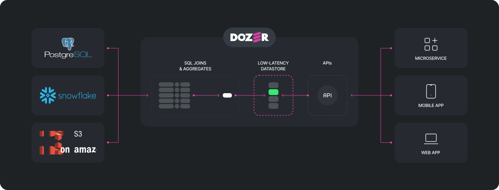

# Introduction

Dozer is a Data API backend platform, engineered primarily to distribute data via low-latency APIs (gRPC and REST), enabling seamless integration with customer-facing applications and downstream systems. It interfaces with a diverse array of data sources, such as databases, data lakes, and warehouses, utilizing Change Data Capture (CDC) for databases and periodic polling for data lakes and warehouses to keep the data fresh and up-to-date.

A standout feature of Dozer is its integrated streaming SQL engine, which enables all sourced data to be joined and transformed in real-time. This real-time transformation and aggregation feature facilitates dynamic data manipulation, providing users with the exact data they require at the right moment.

Additionally, Dozer includes a low-latency datastore where transformed data is stored. This feature allows for high-speed data retrieval, ensuring data accessibility with minimal delay, a critical requirement for customer-facing applications.

Drawing similarities with a Content Delivery Network (CDN), Dozer aims to bring data and APIs closer to the end user. This drastically reduces latency, optimizes performance, and enables the capacity to handle high-volume data operations efficiently. Furthermore, Dozer's distributed architecture ensures scalability and high availability.

## Why Dozer ?
As teams embark on the journey of implementing real-time data applications, they invariably come across a host of challenges that can make the task seem daunting:

1. **Integration with Various Systems**: Integrating the data application with various data sources and downstream systems can present numerous technical hurdles and interoperability issues.

2. **Managing Latency**: Ensuring low-latency data access, especially for customer-facing applications and downstream systems, can be a significant challenge. High latency can lead to slow application performance and poor user experience.

3. **Real-Time Data Transformation**: Managing real-time data transformations, especially when dealing with complex queries or large volumes of data, can be difficult and resource-intensive. 

4. **Maintaining Data Freshness**: Keeping the data up-to-date in real-time, particularly when it's sourced from multiple locations like databases, data lakes, or warehouses, can be a daunting task.

4. **Scalability and High Availability**: Building a data application that can efficiently handle high-volume operations and remain reliable under heavy loads requires advanced architecture design and robust infrastructure.

To address all the above issues, teams often find themselves stitching together multiple technologies and a significant amount of custom code. This could involve integrating diverse systems like Kafka for real-time data streaming, Redis for low-latency data access and caching, and Spark or Flink for processing and analyzing streaming data.

The complexity of such a setup can become overwhelming. Ensuring that these different technologies communicate effectively, maintaining them, and handling potential failure points requires extensive effort and expertise.

This is where Dozer steps in, aiming to dramatically simplify this process. Dozer is designed as an all-in-one backend solution that integrates the capabilities of these disparate technologies into a single, streamlined tool. By doing so, Dozer offers the capacity to build an end-to-end real-time data application without the need to manage multiple technologies and extensive custom code.

## Key Features

1. **Integration with Various Systems**: Dozer is designed to seamlessly integrate with a variety of data sources such as Databases like PostgreSQL, MySQL (coming soon) and MongoDB (coming soon), Data Warehouses like Snowflake and Databricks and file formats like Parquet, Deltalake and CSV. Dozer also implements a connector framework that makes it very easy to support new input formats.

1. **Low-Latency Data Access and API**: Dozer enables low-latency data access and API execution, critical for delivering smooth user experiences and real-time application responses. It offer both gRPC and REST interfaces.

2. **Integrated Streaming SQL Engine**: Dozer features an embedded streaming SQL engine that enables real-time data transformation. This means data from different sources can be joined and transformed on-the-fly.

3. **Embedded Low-Latency Datastore**: To ensure rapid access to data, Dozer comes with a built-in low-latency datastore (based on the Lightning Memory-Mapped Database - LMDB) for storing transformed data. This optimizes the data retrieval process, making it efficient and quick.

4. **Real-Time Data Freshness**: Dozer offers real-time data freshness by using techniques like Change Data Capture (CDC) and periodic polling to detect changes in near real-time, ensuring that your data is always up-to-date.

5. **Scalability and High Availability**: Designed to handle high-volume operations, Dozer provides scalability and high availability. This ensures the robustness of your application, even under heavy loads.

8. **Security and Authorization**: Dozer is designed with robust security measures in place, providing secure data access, and also includes features for managing access and authorization to ensure that only authorized users can access specific data.